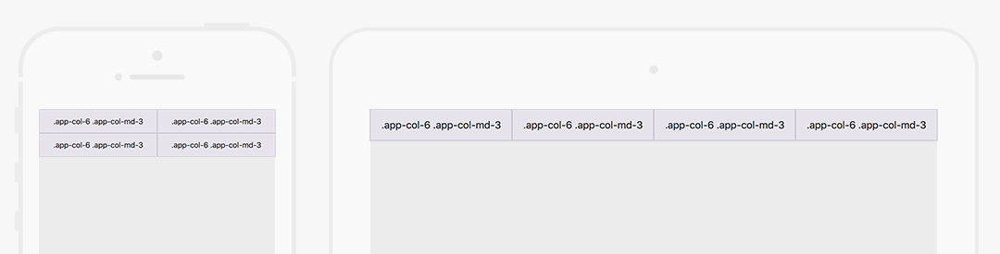
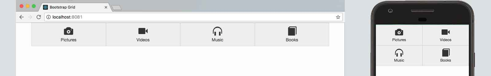
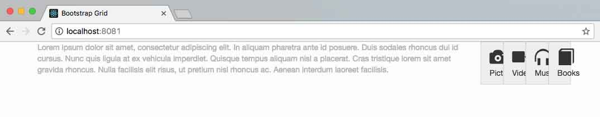
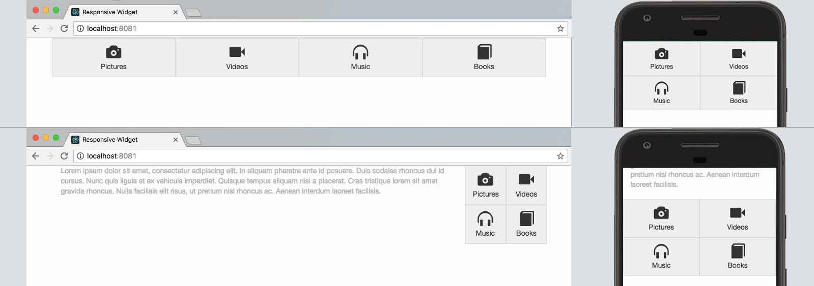

# ReactJs Responsive Widget

**Live demo [here](https://lesfurets.github.io/react-responsive-widget)**

## tl;dr
`react-responsive-widget` is a tool to help you create responsive applications with ReactJs by providing a **bootstrap grid like syntax and some utilities allowing you to change a widget layout depending on its container's size**.

It supports a few features from [Bootstrap 4](https://getbootstrap.com/) :

- grid layout (columns and order) [Bootstrap's grid system](https://getbootstrap.com/docs/4.1/layout/grid/)
- flex utilities [Bootstrap's flex utilities](https://getbootstrap.com/docs/4.1/utilities/flex/)
- display utilities (for responsively toggling common values of the display property) [Bootstrap's display property](https://getbootstrap.com/docs/4.1/utilities/display/)
- alignment utilities (to vertically and horizontally align columns) [Bootstrap's grid system alignment](https://getbootstrap.com/docs/4.1/layout/grid/#alignment).

You can use these features simply by prefixing Bootstrap's classes with `app-`.

It can be installed with npm : 
```bash
$ npm install --save react-responsive-widget
```  

and used as followed :
```js
import React from "react";
import ResponsiveContainer from "react-responsive-widget";

export default class App extends React.Component {
    render() {
        return (
            <ResponsiveContainer>
                <div className="app-row">
                    <div className="app-col-6 app-col-lg-3">.app-col-6 .app-col-lg-3</div>
                    <div className="app-col-6 app-col-lg-3">.app-col-6 .app-col-lg-3</div>
                    <div className="app-col-6 app-col-lg-3">.app-col-6 .app-col-lg-3</div>
                    <div className="app-col-6 app-col-lg-3">.app-col-6 .app-col-lg-3</div>
                </div>
            </ResponsiveContainer>
        )
    }
}
```

# Presentation

Making a responsive widget in ReactJS might be complicated if we don't know the size of the container it will fit in.
Using a simple syntax close to bootstrap grid, the `react-responsive-widget` module allows you to create ReactJS Responsive Application without caring about its integration. 

## Boostrap

### The grid

Bootstrap is a commonly used framework that comes with a grid system used to create responsive, mobile first web pages. 
This system is based on a **12 columns grid** that allows you to define the width an element should have. A component width will then be defined by the number of column (`col-*`) it will occupy on a scale from **1 to 12**. 
As an exemple, a `col-12` will fit the full page width while a `col-6` element will take only half of it.

To make the layout change depending on the screen resolution, bootstrap uses `media query ranges`. There are 4 different breakpoints (by default) :
- no media query necessary for xs breakpoint as it's effectively `@media (min-width: 0)`
- `sm` for small devices (landscape phones) : _resolution between 576px and 768px_
- `md` for medium devices (tablets) : _resolution between 768px and 992px_
- `lg` for large devices (desktops) : _resolution between 992px and 1200px_
- `xl` for extra large devices (large desktops) _resolution greater than 1200px_

With Bootstrap, we only have to add the right `class` to selected html component.
Let's say we have 4 blocks and we want them to be on 2 columns on mobile (default) and 4 columns on tablet (`md`), our ReactJs component will looks like this (to make react syntax easier, we are using jsx) :  

```html
<div className="row">
    <div className="col-6 col-md-3">.col-6 .col-md-3</div>
    <div className="col-6 col-md-3">.col-6 .col-md-3</div>
    <div className="col-6 col-md-3">.col-6 .col-md-3</div>
    <div className="col-6 col-md-3">.col-6 .col-md-3</div>
</div>

```


### Limitations

Bootstrap grid is easy to setup, but the fact that it is based on `media queries` might be a problem when you want your widget to be used in any containers for a given resolution.  
If for example we created a responsive widget using bootstrap with a structure similar to the previous example :       
```html
<div className="row">
    <div className="col-6 col-md-3">
        <div className="glyphicon glyphicon-camera"></div>
        <div>Pictures</div>
    </div>
    <div className="col-6 col-md-3">
        <div className="glyphicon glyphicon-facetime-video"></div>
        <div>Videos</div>
    </div>
    <div className="col-6 col-md-3">
        <div className="glyphicon glyphicon-headphones"></div>
        <div>Music</div>
    </div>
    <div className="col-6 col-md-3">
        <div className="glyphicon glyphicon-book"></div>
        <div>Books</div>
    </div>
</div>

```


For now, everithing works fine, but what would happen if someone decides to use our widget in a sidebar ?



Ugly ... isn't it ? The problem is due to the fact that bootstrap provides only 1 layout for a given screen resolution, no matter what the width of your component's container is. 
In that case, the mobile layout would fit perfectly but it wont be used unless the width is less than 992px. 
It might be easy to fix that page, but as a developper, I would like another solution to create component that will adapt to the space they have rather than a screen resolution. 

## React Responsive Widget

### Presentation

The [react-responsive-widget](https://github.com/lesfurets/react-responsive-widget) module is a simple ReactJs component, available on [npm](https://www.npmjs.com/package/react-responsive-widget) that **allows your components to build their layout depending on their container's width**. 
To make it more straightforward, it uses a syntax similat to [bootstrap 4.1](https://getbootstrap.com/docs/4.1/layout/overview/) and **to avoid conflicts all classes are prefixed with `app-*`**.
To make the layout change depending on the container's width, `react-responsive-widget` uses classes that are added under the `app-container`. There are 5 different classes (by default) :
- `app-xs` container's width under 576px
- `app-sm` container's width between 576px and 768px
- `app-md` container's width between 768px and 992px
- `app-lg` container's width between 992px and 1200px
- `app-xl` container's width greater than 1200px

### Install
As it is a [npm](https://www.npmjs.com/package/react-responsive-widget) module, it is easy to install running :
```bash
$ npm install --save react-responsive-widget
```  

Then, all you have to do is to encapsulate your code in a `ResponsiveContainer` component that you can import with (if you are using a bundler supporting ES6 syntax): 
```bash
import ResponsiveContainer from 'react-responsive-widget'
```

Then with a module bundler like webpack that supports either CommonJS or ES2015 modules, **use as with bootstrap grid syntax prefixed with `app-`** :
```js
import React from "react";
import ResponsiveContainer from "react-responsive-widget";

export default class App extends React.Component {
    render() {
        return (
            <ResponsiveContainer>
                <div className="app-row">
                    <div className="app-col-6 app-col-md-3">.app-col-6 .app-col-md-3</div>
                    <div className="app-col-6 app-col-md-3">.app-col-6 .app-col-md-3</div>
                    <div className="app-col-6 app-col-md-3">.app-col-6 .app-col-md-3</div>
                    <div className="app-col-6 app-col-md-3">.app-col-6 .app-col-md-3</div>
                </div>
            </ResponsiveContainer>
        )
    }
}
```


### Exemple
Let's go back to our code leading to a layout problem and change the code to use ResponsiveContainer :
```html
<ResponsiveContainer>
    <div className="app-row">
        <div className="app-col-6 app-col-md-3">
            <div className="glyphicon glyphicon-camera"></div>
            <div>Pictures</div>
        </div>
        <div className="app-col-6 app-col-md-3">
            <div className="glyphicon glyphicon-facetime-video"></div>
            <div>Videos</div>
        </div>
        <div className="app-col-6 app-col-md-3">
            <div className="glyphicon glyphicon-headphones"></div>
            <div>Music</div>
        </div>
        <div className="app-col-6 app-col-md-3">
            <div className="glyphicon glyphicon-book"></div>
            <div>Books</div>
        </div>
    </div>
</ResponsiveContainer>
```

As you can see the component work as we expected on desktop and mobile, but it also solved the issue we had while using it on a sidebar of the desktop layout.


### Customization

You can change the layout permutation breakpoints as you like by providing specific props to the `ResponsiveContainer`.

```html
<ResponsiveContainer sm="600" md="900" lg="1100" xl="1300">
    ...
</ResponsiveContainer>
```

This will result in :

- `app-xs` container's width under 600px
- `app-sm` container's width between 600px and 900px
- `app-md` container's width between 900px and 1100px
- `app-lg` container's width between 1100px and 1300px
- `app-xl` container's width greater than 1300px

### How it works

As it is not possible for now to have a `media query` equivalent to change layout depending on component width in css, `react-responsive-widget` uses a different approach.
The `ResponsiveContainer` watch screen resizing events and changes its own class depending of its width.
If ResponsiveContainer as a width that is less than 576px (under the sm breakpoint), here is the dom that will be displayed :

```html
    <div className="app-container">
        <div className="app-xs">
            ...
        </div>
    </div>
```

In the case the container's width exceeds 576px (above the sm breakpoint) on window resizing or on another device, we will have :

```html
    <div className="app-container">
        <div className="app-sm">
              ...
        </div>
    </div>
```
