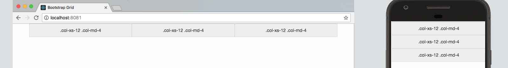
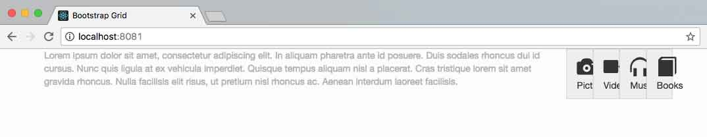
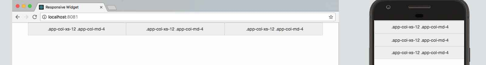
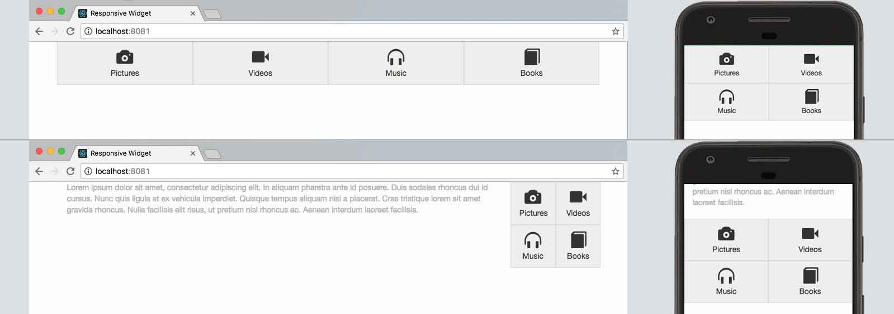
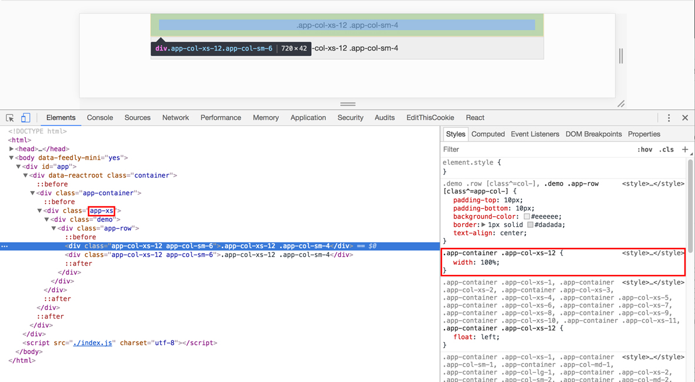
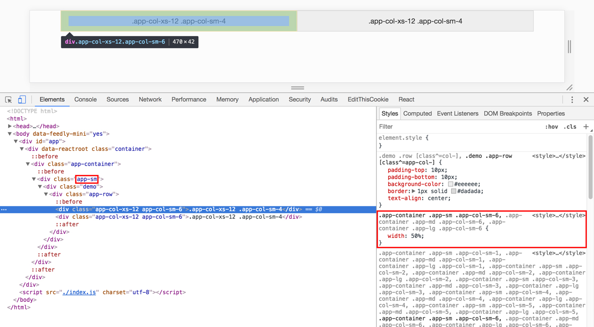

# ReactJs Responsive Widget

## Synopsis
`react-responsive-widget` is a tool to help you creating responsive applications with ReactJs by providing a bootstrap grid like syntax allowing you to change a widget layout depending on it's container size. 

It can be installed with npm : 
```bash
$ npm install --save react-responsive-widget
```  

and used as followed :
```js
import React from "react";
import ResponsiveContainer from "react-responsive-widget";

export default class App extends React.Component {
    render() {
        return (
            <ResponsiveContainer>
                <div className="app-row">
                    <div className="app-col-xs-12 app-col-md-4">.app-col-xs-12 .app-col-md-4</div>
                    <div className="app-col-xs-12 app-col-md-4">.app-col-xs-12 .app-col-md-4</div>
                    <div className="app-col-xs-12 app-col-md-4">.app-col-xs-12 .app-col-md-4</div>
                </div>
            </ResponsiveContainer>
        )
    }
}
```

# Presentation

Making a responsive widget in ReactJS might be complicated if we don't know the size of the container it will fit in.
Using a simple syntax close to bootstrap grid, the `react-responsive-widget` module allows you to create ReactJS Responsive Application without caring about it's integration. 

# Current breakpoint in context

If you wish to use the current breakpoint in your JS code, you may use the available context as followed (inside a ResponsiveContainer):

```js
import React from "react";
import ResponsiveContainer from "react-responsive-widget";

export const DisplayBreakPoint = () => {
    const currentBreakPoint = useContext(ResponsiveContainer.context);
    return <div>current breakpoint: {currentBreakPoint}</div>;
}
```

## Boostrap 
### The grid
Bootstrap is a commonly used framework that comes with a grid system used to create responsive, mobile first web pages. 
This system is based on a **12 columns** grid that allows you to define the witdh an element should have. A component width will then be defined by the number of column (`col-*`) it will occupy on a scale from **1** to **12**. 
As an exemple, a `col-12` will fit the full page width while a `col-6` element will take only half of it.

To make the layout change depending on the screen resolution, bootstrap uses `media query ranges`. There are 4 different configuration that can be setted :
- `xs` for really small screens (mobiles) _resolution less than 768px (default)_ 
- `sm` for small screens(tablette) _resolution between 768px and 992px (default)_
- `md` for medium screens (desktop) _resolution between 992px and 1200px (default)_
- `lg` for large screen (desktop) _resolution greater than 1200px (default)_

To use this system, we only have to add the right `class` to selected html component.
Let's say we have 3 blocks and we want them to use the full page width on mobile (`.col-xs-12`) and to be on 3 columns on desktop (`.col-md-12`), our ReactJs component will looks like this (to make react syntax easier, we are using jsx) :  
```html
<div className="row">
    <div className="col-xs-12 col-md-4">.col-xs-12 .col-md-4</div>
    <div className="col-xs-12 col-md-4">.col-xs-12 .col-md-4</div>
    <div className="col-xs-12 col-md-4">.col-xs-12 .col-md-4</div>
</div>
```


### Limitations
Bootstrap grid is easy to setup, but the fact that it is based on `media queries` might be a problem when you want your widget to be used in any container for a given resolution.  
If for example we created a responsive widget using bootstrap with a structure similar to the previous example :       
```html
<div className="row">
    <div className="col-xs-6 col-md-3">
        <div className="glyphicon glyphicon-camera"></div>
        <div>Pictures</div>
    </div>
    <div className="col-xs-6 col-md-3">
        <div className="glyphicon glyphicon-facetime-video"></div>
        <div>Videos</div>
    </div>
    <div className="col-xs-6 col-md-3">
        <div className="glyphicon glyphicon-headphones"></div>
        <div>Music</div>
    </div>
    <div className="col-xs-6 col-md-3">
        <div className="glyphicon glyphicon-book"></div>
        <div>Books</div>
    </div>
</div>
```


For now, everithing works fine, but what would happen if someone decide to use our widget in a sidebar ?



Ugly ... isn't it ? The problem is due to the fact that bootstrap provides only 1 layout for a given screen resolution, no matter what the width of your component if. 
In that case, the mobile layout would fit perfectly but it wont be used unless the width is less than 768px. 
It might be easy to fix that page, but as a developper, I would like another solution to create component that will adapt to the space they have rather than a screen resolution. 

## React Responsive Widget

### Presentation
The [react-responsive-widget](https://github.com/lesfurets/react-responsive-widget) module is a simple ReactJs component, available on [npm](https://www.npmjs.com/package/react-responsive-widget) that allows your components to be organised depending on their container size. 
To make it more straightforward, it uses a syntax similat to [bootstrap 3.3.7](https://getbootstrap.com/docs/3.3/css/) and to avoid conflicts all classes are prefixed with `app-*`.
The layout permutations depends on the container width are as follow :
- `xs` width less than 768px (default)_ 
- `sm` width between 768px and 992px (default)_
- `md` width between 992px and 1200px (default)_
- `lg` width greater than 1200px (default)_

### Install
As it is a [npm](https://www.npmjs.com/package/react-responsive-widget) module, it is easy to install running :
```bash
$ npm install --save react-responsive-widget
```  

Then, all you have to do is to encapsulate your code in a `ResponsiveContainer` component that you can import with (if you are using a bundler supporting ES6 syntax): 
```bash
import ResponsiveContainer from 'react-responsive-widget'
```

Then with a module bundler like webpack that supports either CommonJS or ES2015 modules, use as with bootstrap grid syntax prefixed with app-*:
```js
import React from "react";
import ResponsiveContainer from "react-responsive-widget";

export default class App extends React.Component {
    render() {
        return (
            <ResponsiveContainer>
                <div className="app-row">
                    <div className="app-col-xs-12 app-col-md-4">.app-col-xs-12 .app-col-md-4</div>
                    <div className="app-col-xs-12 app-col-md-4">.app-col-xs-12 .app-col-md-4</div>
                    <div className="app-col-xs-12 app-col-md-4">.app-col-xs-12 .app-col-md-4</div>
                </div>
            </ResponsiveContainer>
        )
    }
}
```


### Exemple
Let's go back to our code leading to a layout problem and change the code to use ResponsiveContainer :
```html
<ResponsiveContainer>
    <div className="app-row">
        <div className="app-col-xs-6 app-col-md-3">
            <div className="glyphicon glyphicon-camera"></div>
            <div>Pictures</div>
        </div>
        <div className="app-col-xs-6 app-col-md-3">
            <div className="glyphicon glyphicon-facetime-video"></div>
            <div>Videos</div>
        </div>
        <div className="app-col-xs-6 app-col-md-3">
            <div className="glyphicon glyphicon-headphones"></div>
            <div>Music</div>
        </div>
        <div className="app-col-xs-6 app-col-md-3">
            <div className="glyphicon glyphicon-book"></div>
            <div>Books</div>
        </div>
    </div>
</ResponsiveContainer>
```

As you can see the component work as we expected on desktop and mobile, but it also solved the issue we had while using it on a sidebar of the desktop layout.


### Customization
You can change the layout permutation breakpoints as you like by providing specific props to the `ResponsiveContainer`.
```html
<ResponsiveContainer sm="800" md="1000" lg="1400">
    ...
</ResponsiveContainer>
```
Cette definition donnera le comportement suivant
- `xs` width less than 800px 
- `sm` width between 800px and 1000px
- `md` width between 1000px and 1400px
- `lg` width greater than 1400px

### How it works
As it is not possible for now to have a `media query` equivalent to change layout depending on component width in css, `react-responsive-widget` uses a different approach.
The `ResponsiveContainer` watch screen resizing events and changes it's own class depending of it's witdh.
If ResponsiveContainer as a width that is less than 768px (`xs`), here is the dom that be displayed and the related css 
```html
    <div className="app-container">
        <div className="app-xs">
            ...
        </div>
    </div>
```
In the case the container witdh becomes (`sm`) on window resizing or on another device, we will have :
```html
    <div className="app-container">
        <div className="app-sm">
              ...
        </div>
    </div>
```
As you can see on the following examples


